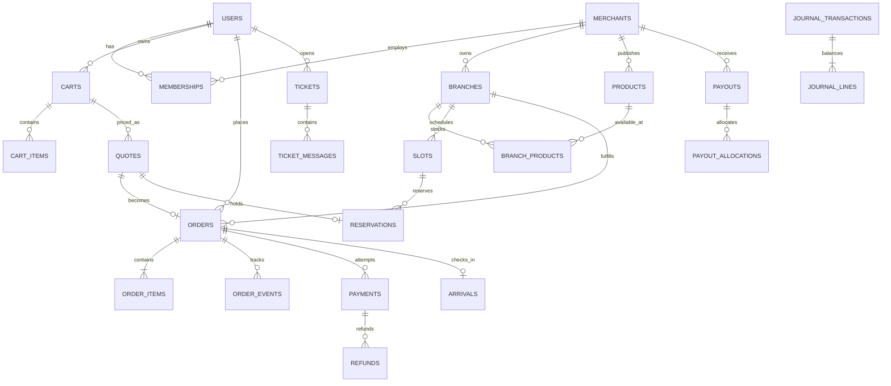

# Core ERD

```mermaid
erDiagram
 USERS ||--o{ MEMBERSHIPS : has
 MERCHANTS ||--o{ MEMBERSHIPS : employs
 MERCHANTS ||--o{ BRANCHES : owns
 MERCHANTS ||--o{ PRODUCTS : publishes
 BRANCHES ||--o{ BRANCH_PRODUCTS : stocks
 PRODUCTS ||--o{ BRANCH_PRODUCTS : available_at
 USERS ||--o{ CARTS : owns
 CARTS ||--o{ CART_ITEMS : contains
 CARTS ||--o{ QUOTES : priced_as
 QUOTES ||--o| ORDERS : becomes
 QUOTES ||--o| RESERVATIONS : holds
 BRANCHES ||--o{ SLOTS : schedules
 SLOTS ||--o{ RESERVATIONS : reserves
 USERS ||--o{ ORDERS : places
 BRANCHES ||--o{ ORDERS : fulfills
 ORDERS ||--|{ ORDER_ITEMS : contains
 ORDERS ||--o{ ORDER_EVENTS : tracks
 ORDERS ||--o{ PAYMENTS : attempts
 PAYMENTS ||--o{ REFUNDS : refunds
 ORDERS ||--o| ARRIVALS : checks_in
 JOURNAL_TRANSACTIONS ||--|{ JOURNAL_LINES : balances
 MERCHANTS ||--o{ PAYOUTS : receives
 PAYOUTS ||--o{ PAYOUT_ALLOCATIONS : allocates
 USERS ||--o{ TICKETS : opens
 TICKETS ||--o{ TICKET_MESSAGES : contains
```
Core relationships only; complete table contract in docs/06-database-schema.md. Validate generated Prisma migrations against that document.
