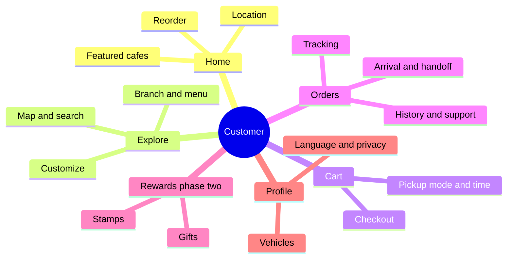
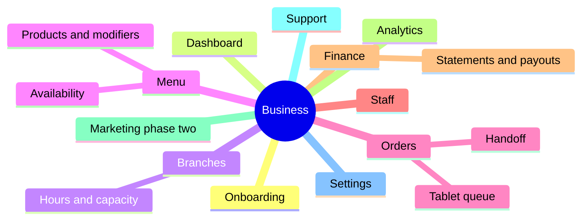
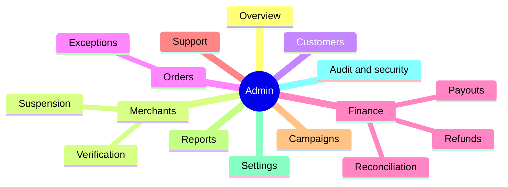
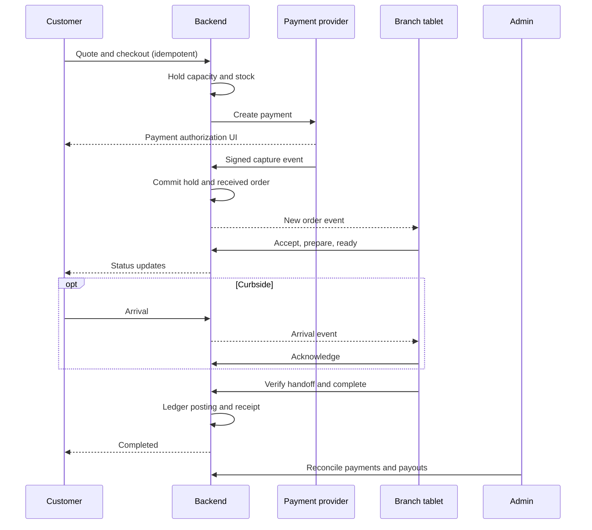

# User mind maps and cross-role sequence

```mermaid
mindmap
 root((Customer))
  Home
   Location
   Featured cafes
   Reorder
  Explore
   Map and search
   Branch and menu
   Customize
  Cart
   Pickup mode and time
   Checkout
  Orders
   Tracking
   Arrival and handoff
   History and support
  Rewards phase two
   Stamps
   Gifts
  Profile
   Vehicles
   Language and privacy
```

```mermaid
mindmap
 root((Business))
  Onboarding
  Dashboard
  Branches
   Hours and capacity
  Menu
   Products and modifiers
   Availability
  Orders
   Tablet queue
   Handoff
  Staff
  Finance
   Statements and payouts
  Analytics
  Marketing phase two
  Support
  Settings
```

```mermaid
mindmap
 root((Admin))
  Overview
  Merchants
   Verification
   Suspension
  Customers
  Orders
   Exceptions
  Finance
   Refunds
   Reconciliation
   Payouts
  Support
  Campaigns
  Reports
  Settings
  Audit and security
```

```mermaid
sequenceDiagram
 participant C as Customer
 participant API as Backend
 participant P as Payment provider
 participant T as Branch tablet
 participant A as Admin
 C->>API: Quote and checkout (idempotent)
 API->>API: Hold capacity and stock
 API->>P: Create payment
 P-->>C: Payment authorization UI
 P->>API: Signed capture event
 API->>API: Commit hold and received order
 API-->>T: New order event
 T->>API: Accept, prepare, ready
 API-->>C: Status updates
 opt Curbside
 C->>API: Arrival
 API-->>T: Arrival event
 T->>API: Acknowledge
 end
 T->>API: Verify handoff and complete
 API->>API: Ledger posting and receipt
 API-->>C: Completed
 A->>API: Reconcile payments and payouts
```
